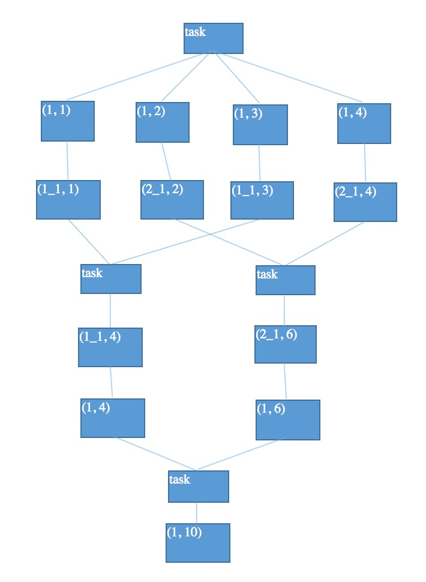
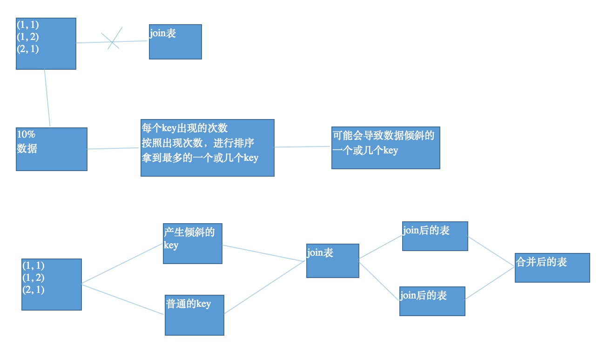

# StudySpark
spark的一个小项目以及笔记

# 目录

* [项目内容](#项目内容)
* [学习笔记](#学习笔记)
    * [一些操作](#一些操作)
    * [性能调优](#性能调优还有这种操作boom)
        * [调节并行度](#调节并行度)
        * [重构RDD与持久化](#重构rdd与持久化)
        * [广播大变量](#广播大变量)
        * [使用Kryo序列化](#使用kryo序列化)
        * [使用fastutil优化数据格式](#使用fastutil优化数据格式)
        * [调节数据本地化等待时长](#调节数据本地化等待时长)
        * [JVM调优之降低cache操作的内存占比](#jvm调优之降低cache操作的内存占比)
        * [JVM调优之调节Executor堆外内存与连接等待时长](#jvm调优之调节executor堆外内存与连接等待时长)
    * [Shuffle调优](#shuffle调优)
        * [调节Map端内存缓冲与Reduce端内存占比](#调节map端内存缓冲与reduce端内存占比)
        * [spark.shuffle.sort.bypassMergeThreshold](#sparkshufflesortbypassmergethreshold)
    * [算子调优](#算子调优)
        * [map与mapPartitions](#map与mappartitions)
        * [filter过后使用coalesce](#filter过后使用coalesce)
        * [foreachPartition优化写数据库](#foreachpartition优化写数据库)
        * [repartition解决Spark SQL并行度过低](#repartition解决spark-sql并行度过低)
        * [reduceByKey的Map端本地聚合](#reducebykey的map端本地聚合)
    * [troubleShooting](#troubleshooting)
        * [控制shuffle reduce端缓冲大小以避免OOM](#控制shuffle-reduce端缓冲大小以避免oom)
        * [JVM GC导致shuffle文件拉取失败](#jvm-gc导致shuffle文件拉取失败)
        * [Yarn队列资源不足导致Application直接失败](#yarn队列资源不足导致application直接失败)
        * [各种序列化导致的报错](#各种序列化导致的报错)
        * [算子函数返回NULL导致的问题](#算子函数返回null导致的问题)
        * [Yarn-cluster模式JVM内存溢出无法执行](#yarn-cluster模式jvm内存溢出无法执行)
    * [数据倾斜解决方案](#数据倾斜解决方案)
        * [聚合源数据](#聚合源数据)
        * [提高shuffle操作的reduce并行度](#提高shuffle操作的reduce并行度)
        * [使用随机key实现双重聚合](#使用随机key实现双重聚合)
        * [将reduce join转为map join](#将reduce-join转为map-join)
        * [sample采样倾斜key进行两次join](#sample采样倾斜key进行两次join)
        * [使用随机数以及扩容表进行join](#使用随机数以及扩容表进行join)
    * [Spark SQL数据倾斜解决方案](#spark-sql数据倾斜解决方案)
    * [Spark Streaming](#spark-streaming)
        * [Spark Streaming高可用](#spark-streaming高可用)
        * [Spark Streaming性能调优](#spark-streaming性能调优)


## 项目内容
1. **用户访问session分析模块**

* 用户访问session分析业务，session聚合统计、session随机抽取、top10热门分类、top10活跃用户  
    > 1、按条件筛选session  
      2、统计出符合条件的session中，访问时长在1s\~3s、4s\~6s、7s\~9s、10s\~30s、30s\~60s、1m\~3m、3m\~10m、10m\~30m、30m以上各个范围内的session占比；访问步长在1~3、4~6、7~9、10~30、30~60、60以上各个范围内的session占比  
      3、在符合条件的session中，按照时间比例随机抽取1000个session  
      4、在符合条件的session中，获取点击、下单和支付数量排名前10的品类  
      5、对于排名前10的品类，分别获取其点击次数排名前10的session  

* 技术点：数据的过滤与聚合、自定义Accumulator、按时间比例随机抽取算法、二次排序、分组取topN  
* 性能调优方案：普通调优、jvm调优、shuffle调优、算子调优  
* troubleshooting经验  
* 数据倾斜解决方案：7种方案  

代码：[UserVisitSessionAnalyzeSpark](./src/main/java/com/yt/spark/spark/session/UserVisitSessionAnalyzeSpark.java)  

2. **页面单跳转化率模块**

* 页面单跳转化率模块业务
   > 1、获取任务的日期范围参数  
     2、查询指定日期范围内的用户访问行为数据  
     3、获取用户访问行为中，每个session，计算出各个在指定页面流中的页面切片的访问量；实现，页面单跳切片生成以及页面流匹配的算法；session，3->8->7，3->5->7，是不匹配的；  
     4、计算出符合页面流的各个切片的pv（访问量）  
     5、针对用户指定的页面流，去计算各个页面单跳切片的转化率  
     6、将计算结果持久化到数据库中  

代码：[PageOneStepConvertRateSpark](./src/main/java/com/yt/spark/spark/page/PageOneStepConvertRateSpark.java)

3. **各区域热门商品统计模块**

* 各区域热门商品统计模块业务
   > 根据用户指定的日期范围，统计各个区域下的最热门的top3商品

* 技术点：Hive与MySQL异构数据源、RDD转换为DataFrame、注册和使用临时表、自定义UDAF聚合函数、自定义get_json_object等普通函数、Spark SQL的高级内置函数（if与case when等）、开窗函数（高端）  
* Spark SQL数据倾斜解决方案

代码：[AreaTop3ProductSpark](./src/main/java/com/yt/spark/spark/product/AreaTop3ProductSpark.java)


4. **广告流量实时统计模块**

* 广告流量实时统计模块业务
   > 1、实现实时的动态黑名单机制：将每天对某个广告点击超过100次的用户拉黑  
     2、基于黑名单的非法广告点击流量过滤机制：  
     3、每天各省各城市各广告的点击流量实时统计：  
     4、统计每天各省top3热门广告  
     5、统计各广告最近1小时内的点击量趋势：各广告最近1小时内各分钟的点击量  
     6、使用高性能方式将实时统计结果写入MySQL  
     7、实现实时计算程序的HA高可用性（Spark Streaming HA方案）  
     8、实现实时计算程序的性能调优（Spark Streaming Performence Tuning方案）  

* 技术点：动态黑名单机制（动态生成黑名单以及黑名单过滤）、transform、updateStateByKey、transform与Spark SQL整合、window滑动窗口、高性能写数据库  
* HA方案：高可用性方案，3种  
* 性能调优：常用的性能调优的技巧

代码：[AdClickRealTimeStatSpark](./src/main/java/com/yt/spark/spark/ad/AdClickRealTimeStatSpark.java)


## 学习笔记

### 一些操作

1. 数据库连接池与JDBC辅助组件  

&emsp;&emsp;因为与数据的连接(Connection)是一种很重要的资源，如果每次使用数据库都要创建一个连接是很耗费资源的，所以设计一个数据库连接池，
创建一些数据库连接存放在里面，要用的时候从里面取，用完了不是直接关闭而是再放回去，这样就能节省资源。  
主要的代码参见：[JDBCHelper](./src/main/java/com/yt/spark/jdbc/JDBCHelper.java)

2. 自定义Accumulator

&emsp;&emsp;自定义Accumulator要继承AccumulatorV2
[SessionAggrStatAccumulator](./src/main/java/com/yt/spark/spark/session/SessionAggrStatAccumulator.java)

3. 二次排序

&emsp;&emsp;二次排序就是要继承Ordered，和java的Comparator很像
[CategorySortKey](./src/main/java/com/yt/spark/spark/session/CategorySortKey.java)

### 性能调优(还有这种操作:boom:)

#### 调节并行度

&emsp;&emsp;并行度：其实就是指的是，Spark作业中，各个stage的task数量，也就代表了Spark作业的在各个阶段（stage）的并行度。  
> 假设，现在已经在spark-submit脚本里面，给我们的spark作业分配了足够多的资源，比如50个executor，每个executor有10G内存，每个executor有3个cpu core。基本已经达到了集群或者yarn队列的资源上限。
  但是task没有设置，或者设置的很少，比如就设置了，100个task。50个executor，每个executor有3个cpu core，也就是说，你的Application任何一个stage运行的时候，都有总数在150个cpu core，可以并行运行。但是你现在，只有100个task，平均分配一下，每个executor分配到2个task，ok，那么同时在运行的task，只有100个，每个executor只会并行运行2个task。每个executor剩下的一个cpu core，就浪费掉了。

1. **官方推荐**，task数量设置成spark application总cpu core数量的2\~3倍，比如150个cpu core，基本要设置task数量为300\~500

2. **如何设置一个Spark Application的并行度** 
``` scala
SparkConf conf = new SparkConf()
  .set("spark.default.parallelism", "500")
```

#### 重构RDD与持久化

1. **_RDD架构重构与优化_**

&emsp;&emsp;尽量去复用RDD，差不多的RDD，可以抽取称为一个共同的RDD，供后面的RDD计算时，反复使用。

2. **_公共RDD一定要实现持久化_**

&emsp;&emsp;对于要多次计算和使用的公共RDD，一定要进行持久化。

3. **_持久化，是可以进行序列化的_**

&emsp;&emsp;如果正常将数据持久化在内存中，那么可能会导致内存的占用过大，这样的话，也许，会导致OOM内存溢出。  
当纯内存无法支撑公共RDD数据完全存放的时候，就优先考虑，使用序列化的方式在纯内存中存储。将RDD的每个partition的数据，序列化成一个大的字节数组，就一个对象；序列化后，大大减少内存的空间占用。  
如果序列化纯内存方式，还是导致OOM，内存溢出；就只能考虑磁盘的方式，内存+磁盘的普通方式（无序列化）。  
**缺点**：在获取数据的时候需要反序列化

4. **_数据的高可靠性_**

&emsp;&emsp;在内存资源很充沛的情况下，可以持久化一个副本

#### 广播大变量

&emsp;&emsp;而每个task在处理变量的时候，都会拷贝一份变量的副本，如果变量很大的话，就会耗费很多内存。这时可以采用广播变量的方式，把这个变量广播出去，因为广播变量只在每个节点的Executor才一份副本
广播变量在初始的时候，就只在Driver上有一份。task在运行的时候，想要使用广播变量中的数据，此时首先会在自己本地的Executor对应的BlockManager中，尝试获取变量副本；如果本地没有，那么就从Driver远程拉取变量副本，并保存在本地的BlockManager中；此后这个executor上的task，都会直接使用本地的BlockManager中的副本。
executor的BlockManager除了从driver上拉取，也可能从其他节点的BlockManager上拉取变量副本，总之越近越好。

#### 使用Kryo序列化

&emsp;&emsp;默认情况下，Spark内部是使用Java的序列化机制，ObjectOutputStream/ObjectInputStream，对象输入输出流机制，来进行序列化。    
&emsp;&emsp;**优点**：处理起来比较方便，只是在算子里面使用的变量，必须是实现Serializable接口的。   
&emsp;&emsp;**缺点**：默认的序列化机制的效率不高，序列化的速度比较慢；序列化以后的数据，占用的内存空间相对还是比较大。    
&emsp;&emsp;Kryo序列化机制，比默认的Java序列化机制，速度要快，序列化后的数据要更小，大概是Java序列化机制的1/10。  
&emsp;&emsp;Kryo序列化机制，一旦启用以后，会生效的几个地方：
1. 算子函数中使用到的外部变量，使用Kryo后，优化网络传输的性能，可以优化集群中内存的占用和消耗
2. 持久化RDD时进行序列化，StorageLevel.MEMORY_ONLY_SER。持久化RDD占用的内存越少，task执行的时候创建的对象，就不至于频繁的占满内存，频繁发生GC。
3. shuffle：可以优化网络传输的性能

&emsp;&emsp;使用Kryo序列化步骤：
1. SparkConf.set("spark.serializer", "org.apache.spark.serializer.KryoSerializer")
2. 注册你使用到的，需要通过Kryo序列化的自定义类。SparkConf.registerKryoClasses(new Class[]{CategorySoryKey.class})

#### 使用fastutil优化数据格式
* **fastutil介绍**
> fastutil是扩展了Java标准集合框架（Map、List、Set；HashMap、ArrayList、HashSet）的类库，提供了特殊类型的map、set、list和queue；
  fastutil能够提供更小的内存占用，更快的存取速度；我们使用fastutil提供的集合类，来替代自己平时使用的JDK的原生的Map、List、Set，好处在于，fastutil集合类，可以减小内存的占用，并且在进行集合的遍历、根据索引（或者key）获取元素的值和设置元素的值的时候，提供更快的存取速度；
  fastutil也提供了64位的array、set和list，以及高性能快速的，以及实用的IO类，来处理二进制和文本类型的文件
  
&emsp;&emsp;fastutil的每一种集合类型，都实现了对应的Java中的标准接口（比如fastutil的map，实现了Java的Map接口），因此可以直接放入已有系统的任何代码中。
fastutil还提供了一些JDK标准类库中没有的额外功能（比如双向迭代器）。

&emsp;&emsp;fastutil除了对象和原始类型为元素的集合，fastutil也提供引用类型的支持，但是对引用类型是使用等于号（=）进行比较的，而不是equals()方法。

* **Spark中应用fastutil的场景**

1. 如果算子函数使用了外部变量；那么第一，你可以使用Broadcast广播变量优化；第二，可以使用Kryo序列化类库，提升序列化性能和效率；第三，如果外部变量是某种比较大的集合，那么可以考虑使用fastutil改写外部变量，首先从源头上就减少内存的占用，通过广播变量进一步减少内存占用，再通过Kryo序列化类库进一步减少内存占用。

2. 在你的算子函数里，如果要创建比较大的Map、List等集合，可能会占用较大的内存空间，而且可能涉及到消耗性能的遍历、存取等集合操作；那么此时，可以考虑将这些集合类型使用fastutil类库重写，使用了fastutil集合类以后，就可以在一定程度上，减少task创建出来的集合类型的内存占用。避免executor内存频繁占满，频繁唤起GC，导致性能下降。

``` xml
<dependency>
  <groupId>it.unimi.dsi</groupId>
  <artifactId>fastutil</artifactId>
  <version>7.0.6</version>
</dependency>
```
> [UserVisitSessionAnalyzeSpark.java](./src/main/java/com/yt/spark/spark/session/UserVisitSessionAnalyzeSpark.java)中831行有示例。

#### 调节数据本地化等待时长
&emsp;&emsp;`PROCESS_LOCAL > NODE_LOCAL > NO_PREF > RACK_LOCAL > ANY`  Spark要对任务(task)进行分配的时候, 会计算出每个task要计算的是哪个分片的数据(partition)，Spark的task分配算法，会按照上面的顺序来进行分配。  
可能PROCESS_LOCAL节点的计算资源和计算能力都满了；Spark会等待一段时间，默认情况下是3s钟(不是绝对的，还有很多种情况，对不同的本地化级别，都会去等待)，到最后，就会选择一个比较差的本地化级别，比如说，将task分配到靠它要计算的数据所在节点，比较近的一个节点，然后进行计算。  

* **何时调节这个参数**

&emsp;&emsp;观察日志，spark作业的运行日志，先用client模式，在本地就直接可以看到比较全的日志。日志里面会显示，starting task...，PROCESS LOCAL、NODE LOCAL
如果是发现，好多的级别都是NODE_LOCAL、ANY，那么最好就去调节一下数据本地化的等待时长。调节完，应该是要反复调节，每次调节完以后，再来运行，观察日志
`spark.locality.wait`, 3s, 6s, 10s...

#### JVM调优之降低cache操作的内存占比
&emsp;&emsp;spark中，堆内存又被划分成了两块儿，一块儿是专门用来给RDD的cache、persist操作进行RDD数据缓存用的；另外一块儿，用来给spark算子函数的运行使用的，存放函数中自己创建的对象。

&emsp;&emsp;默认情况下，给RDD cache操作的内存占比，是0.6，60%的内存都给了cache操作了。但是问题是，如果某些情况下，cache不是那么的紧张，问题在于task算子函数中创建的对象过多，然后内存又不太大，导致了频繁的minor gc，甚至频繁full gc，导致spark频繁的停止工作。性能影响会很大。

&emsp;&emsp;可以通过spark ui，如果是spark on yarn的话，那么就通过yarn的界面，去查看你的spark作业的运行统计。可以看到每个stage的运行情况，包括每个task的运行时间、gc时间等等。如果发现gc太频繁，时间太长。此时就可以适当调价这个比例。

&emsp;&emsp;降低cache操作的内存占比，大不了用persist操作，选择将一部分缓存的RDD数据写入磁盘，或者序列化方式，配合Kryo序列化类，减少RDD缓存的内存占用；降低cache操作内存占比；对应的，算子函数的内存占比就提升了。这个时候，可能，就可以减少minor gc的频率，同时减少full gc的频率。对性能的提升是有一定的帮助的。

&emsp;&emsp;`spark.storage.memoryFraction，0.6 -> 0.5 -> 0.4 -> 0.2`

#### JVM调优之调节Executor堆外内存与连接等待时长
* **Executor堆外内存**  

&emsp;&emsp;有时候，如果你的spark作业处理的数据量特别特别大，几亿数据量；然后spark作业一运行，时不时的报错，shuffle file cannot find，executor、task lost，out of memory（内存溢出）

&emsp;&emsp;可能是说executor的堆外内存不太够用，导致executor在运行的过程中，可能会内存溢出；然后可能导致后续的stage的task在运行的时候，可能要从一些executor中去拉取shuffle map output文件，
但是executor可能已经挂掉了，关联的block manager也没有了；所以可能会报shuffle output file not found；resubmitting task；executor lost；spark作业彻底崩溃。

   ```
   --conf spark.yarn.executor.memoryOverhead=2048
   ```

&emsp;&emsp;**_spark-submit脚本里面，去用--conf的方式，去添加配置；_** 切记，不是在你的spark作业代码中，用new SparkConf().set()这种方式去设置，不要这样去设置，是没有用的！一定要在spark-submit脚本中去设置。

&emsp;&emsp;默认情况下，这个堆外内存上限大概是300多M；通常项目，真正处理大数据的时候，这里都会出现问题，导致spark作业反复崩溃，无法运行；此时就会去调节这个参数，到至少1G（1024M），甚至说2G、4G

* **连接等待时长**  

&emsp;&emsp;如果Executor远程从另一个Executor中拉取数据的时候，那个Executor正好在gc，此时呢，无法建立网络连接，会卡住；spark默认的网络连接的超时时长，是60s；如果卡住60s都无法建立连接的话，那么就宣告失败了。

&emsp;&emsp;碰到某某file。一串file id。uuid（dsfsfd-2342vs--sdf--sdfsd）。not found。file lost。很有可能是有那份数据的executor在jvm gc。所以拉取数据的时候，建立不了连接。然后超过默认60s以后，直接宣告失败。

```
--conf spark.core.connection.ack.wait.timeout=300
```
&emsp;&emsp;**_spark-submit脚本，切记，不是在new SparkConf().set()这种方式来设置的_**。通常来说，可以避免部分的偶尔出现的某某文件拉取失败，某某文件lost


### Shuffle调优

#### 调节Map端内存缓冲与Reduce端内存占比

* **问题**

&emsp;&emsp;默认情况下，shuffle的map task，输出到磁盘文件的时候，统一都会先写入每个task自己关联的一个内存缓冲区。这个缓冲区大小，默认是32kb。
每一次，当内存缓冲区满溢之后，才会进行spill操作，溢写操作，溢写到磁盘文件中去。

&emsp;&emsp;reduce端task，在拉取到数据之后，会用HashMap的数据格式，来对各个key对应的values进行汇聚。在进行汇聚、聚合等操作的时候，实际上，使用的就是自己对应的executor的内存，executor（jvm进程，堆），默认executor内存中划分给reduce task进行聚合的比例，是0.2。
问题来了，因为比例是0.2，所以，理论上，很有可能会出现，拉取过来的数据很多，那么在内存中，放不下；这个时候，默认的行为，就是说，将在内存放不下的数据，都spill（溢写）到磁盘文件中去。

* **调优**
```
spark.shuffle.file.buffer
spark.shuffle.memoryFraction
```
&emsp;&emsp;在Spark UI或者是Yarn任务调度界面，如果发现shuffle过程中磁盘的write和read很大。这个时候，就意味着最好调节一些shuffle的参数。首先当然是考虑开启map端输出文件合并机制。
调节的时候的原则。spark.shuffle.file.buffer，每次扩大一倍，然后看看效果，64，128；spark.shuffle.memoryFraction，每次提高0.1，看看效果。


#### spark.shuffle.sort.bypassMergeThreshold
&emsp;&emsp;这个配置的默认值是200，用于设置在Reducer的partition数目少于多少的时候，Sort Based Shuffle内部不使用Merge Sort的方式处理数据，而是直接将每个partition写入单独的文件。这个方式和Hash Based的方式是类似的，区别就是在最后这些文件还是会合并成一个单独的文件，
并通过一个index索引文件来标记不同partition的位置信息。从Reducer看来，数据文件和索引文件的格式和内部是否做过Merge Sort是完全相同的。

&emsp;&emsp;这个可以看做SortBased Shuffle在Shuffle量比较小的时候对于Hash Based Shuffle的一种折衷。当然了它和Hash Based Shuffle一样，也存在同时打开文件过多导致内存占用增加的问题。因此如果GC比较严重或者内存比较紧张，可以适当的降低这个值。


### 算子调优

#### map与mapPartitions
* **问题**

&emsp;&emsp;如果是普通的map，比如一个partition中有1万条数据；那么你的function要执行和计算1万次。使用MapPartitions操作之后，一个task仅仅会执行一次function，function一次接收所有的partition数据。只要执行一次就可以了，性能比较高。  
缺点也很显而易见，就是一个partition中数据量太大会导致OOM。

* **调优**

&emsp;&emsp;所以说在数据量不是很大的时候可以用这个。

#### filter过后使用coalesce
* **问题**

&emsp;&emsp;1、每个partition数据量变少了，但是在后面进行处理的时候，还是要跟partition数量一样数量的task，来进行处理；有点浪费task计算资源。  
&emsp;&emsp;2、每个partition的数据量不一样，会导致后面的每个task处理每个partition的时候，每个task要处理的数据量就不同，这个时候很容易发生数据倾斜

* **调优**

&emsp;&emsp;coalesce算子主要就是用于在filter操作之后，针对每个partition的数据量各不相同的情况，来压缩partition的数量。减少partition的数量，而且让每个partition的数据量都尽量均匀紧凑。

#### foreachPartition优化写数据库
* **问题**

&emsp;&emsp;foreach会对每条数据都创建一个数据库连接，很消耗性能

* **调优**

&emsp;&emsp;使用foreachPartition，只会对一个partition中的数据创建一个连接

#### repartition解决Spark SQL并行度过低

* **问题**

&emsp;&emsp;在[调节并行度](#调节并行度)中介绍了并行度应该怎么设置，如果没有使用Spark SQL，那么整个spark application默认所有stage的并行度都是你设置的那个参数（除非使用coalesce算子缩减过partition数量）。  
如果用了Spark SQL，那个stage的并行度，你没法自己指定。Spark SQL自己会默认根据hive表对应的hdfs文件的block，自动设置Spark SQL查询所在的那个stage的并行度。通过spark.default.parallelism参数指定的并行度，只会在没有Spark SQL的stage中生效。  

* **调优**

&emsp;&emsp;可以将你用Spark SQL查询出来的RDD，使用repartition算子，去重新进行分区，此时可以分区成多个partition，比如从20个partition，分区成100个。

#### reduceByKey的Map端本地聚合
&emsp;&emsp;reduceByKey，相较于普通的shuffle操作（比如groupByKey），它的一个特点，会进行map端的本地聚合。下一个stage，拉取数据的量，也就变少了。减少网络的数据传输的性能消耗。
要实现类似于wordcount程序一样的，对每个key对应的值，进行某种数据公式或者算法的计算（累加、类乘）就可以使用reduceByKey。


### troubleShooting

#### 控制shuffle reduce端缓冲大小以避免OOM
&emsp;&emsp;有的时候，map端的数据量特别大，然后写出的速度特别快。reduce端所有task，拉取的时候，全部达到自己的缓冲的最大极限值，48M，全部填满。这个时候，再加上你的reduce端执行的聚合函数的代码，可能会创建大量的对象。
然后，内存就撑不住了，就会OOM。reduce端的内存中，就会发生内存溢出的问题。

&emsp;&emsp;这个时候，就应该减少reduce端task缓冲的大小。我宁愿多拉取几次，但是每次同时能够拉取到reduce端每个task的数量，比较少，就不容易发生OOM内存溢出的问题。（比如，可以调节成12M）

#### JVM GC导致shuffle文件拉取失败
&emsp;&emsp;这个问题在[JVM调优之调节Executor堆外内存与连接等待时长](#jvm调优之调节executor堆外内存与连接等待时长)中提到过, 其中只讲了连接等待的时间，这里还可以配置两个参数
```
spark.shuffle.io.maxRetries 3
spark.shuffle.io.retryWait 5s
```
&emsp;&emsp;**第一个参数**，意思就是说，shuffle文件拉取的时候，如果没有拉取到（拉取失败），最多或重试几次（会重新拉取几次文件），默认是3次。

&emsp;&emsp;**第二个参数**，意思就是说，每一次重试拉取文件的时间间隔，默认是5s钟。


#### Yarn队列资源不足导致Application直接失败
&emsp;&emsp;不同执行时间提交到不同的队列中去等待，可以通过线程池(一个线程池对应一个资源队列)的方法来实现。

#### 各种序列化导致的报错
&emsp;&emsp;如果日志文件中出现了类似于Serializable、Serialize等等报错的log，那就是出现了序列化报错。  
序列化报错要注意的三个点：

1. 你的算子函数里面，如果使用到了外部的自定义类型的变量，那么此时，就要求你的自定义类型，必须是可序列化的。
``` java
final Teacher teacher = new Teacher("leo");

studentsRDD.foreach(new VoidFunction() {
 
public void call(Row row) throws Exception {
  String teacherName = teacher.getName();
  ....  
}

});

public class Teacher implements Serializable {
  
}
```

2. 如果要将自定义的类型，作为RDD的元素类型，那么自定义的类型也必须是可以序列化的
``` java
JavaPairRDD<Integer, Teacher> teacherRDD
JavaPairRDD<Integer, Student> studentRDD
studentRDD.join(teacherRDD)

public class Teacher implements Serializable {
  
}

public class Student implements Serializable {
  
}
```

3. 不能在上述两种情况下，去使用一些第三方的，不支持序列化的类型
``` java
Connection conn = 

studentsRDD.foreach(new VoidFunction() {
 
public void call(Row row) throws Exception {
  conn.....
}

});
```
> **_Connection是不支持序列化的_**

#### 算子函数返回NULL导致的问题
&emsp;&emsp;在有些算子函数里面，是需要我们有一个返回值的。但是，有时候，我们可能对某些值，就是不想有什么返回值。我们如果直接返回NULL的话，那么可以不幸的告诉大家，是不行的，会报错的。

* **解决办法**
1. 在返回的时候，返回一些特殊的值，不要返回null，比如“-999”
2. 在通过算子获取到了一个RDD之后，可以对这个RDD执行filter操作，进行数据过滤。filter内，可以对数据进行判定，如果是-999，那么就返回false，给过滤掉就可以了。
3. 在filter之后，可以使用coalesce算子压缩一下RDD的partition的数量，让各个partition的数据比较紧凑一些。也能提升一些性能。


#### Yarn-cluster模式JVM内存溢出无法执行
&emsp;&emsp;有的时候，运行一些包含了spark sql的spark作业，可能会碰到yarn-client模式下，可以正常提交运行；yarn-cluster模式下，可能是无法提交运行的，会报出JVM的PermGen（永久代）的内存溢出，OOM。
yarn-client模式下，driver是运行在本地机器上的，spark使用的JVM的PermGen的配置，是本地的spark-class文件（spark客户端是默认有配置的），JVM的永久代的大小是128M，这个是没有问题的；但是呢，在yarn-cluster模式下，driver是运行在yarn集群的某个节点上的，使用的是没有经过配置的默认设置（PermGen永久代大小），82M。
spark-sql，它的内部是要进行很复杂的SQL的语义解析、语法树的转换等等，特别复杂，在这种复杂的情况下，如果说你的sql本身特别复杂的话，很可能会比较导致性能的消耗，内存的消耗。可能对PermGen永久代的占用会比较大。

&emsp;&emsp;spark-submit脚本中，加入以下配置即可：
```
--conf spark.driver.extraJavaOptions="-XX:PermSize=128M -XX:MaxPermSize=256M"
```

> **Tips:**  
   Spark SQL，有大量的or语句。比如where keywords='' or keywords='' or keywords=''
   当达到or语句，有成百上千的时候，此时可能就会出现一个driver端的jvm stack overflow，JVM栈内存溢出的问题。
   因此可以吧sql语句拆分成多条sql语句来执行


### 数据倾斜解决方案

#### 聚合源数据
**1. 第一种方案**

&emsp;&emsp;一般都是hive表中对每个key进行聚合，按照key进行分组，将key对应的所有的values，全部用一种特殊的格式，拼接到一个字符串里面去，比如`“key=sessionid, value: action_seq=1|user_id=1|search_keyword=火锅|category_id=001;action_seq=2|user_id=1|search_keyword=涮肉|category_id=001”`。
对key进行group，在spark中拿到的数据就是key=sessionid，values<Iterable>，所以在spark中就不需要再去执行groupByKey+map这种操作了。直接对每个key对应的values字符串，map操作，进行你需要的操作即可。key,values串。

**2. 第二种方案**

&emsp;&emsp;你可能没有办法对每个key，就聚合出来一条数据；那么也可以做一个妥协；对每个key对应的数据，10万条；有好几个粒度，比如10万条里面包含了几个城市、几天、几个地区的数据，现在放粗粒度；直接就按照城市粒度，做一下聚合，几个城市，几天、几个地区粒度的数据，都给聚合起来。


#### 提高shuffle操作的reduce并行度
&emsp;&emsp;将reduce task的数量变多，就可以让每个reduce task分配到更少的数据量，这样的话，也许就可以缓解，或者甚至是基本解决掉数据倾斜的问题。

&emsp;&emsp;方法主要是给我们所有的shuffle算子，比如groupByKey、countByKey、reduceByKey。在调用的时候，传入进去一个数字。那个数字，就代表了那个shuffle操作的reduce端的并行度。那么在进行shuffle操作的时候，就会对应着创建指定数量的reduce task。就可以让每个reduce task分配到更少的数据。基本可以缓解数据倾斜的问题。

#### 使用随机key实现双重聚合
&emsp;&emsp;如下图所示, 我们可以把导致数据倾斜的key打上不同的随机前缀，这样就划分成多个不同的key
<div align=center>
    
</div>

&emsp;&emsp;groupByKey和reduceByKey使用这用会有很好的效果。

#### 将reduce join转为map join
&emsp;&emsp;reduce join就是普通的join，是需要shuffle的。如下图所示
<div align=center>
    
</div>

&emsp;&emsp;如果两个RDD要进行join，其中一个RDD是比较小的。一个RDD是100万数据，一个RDD是1万数据。broadcast出去那个小RDD的数据以后，就会在每个executor的block manager中都驻留一份。
要确保你的内存足够存放那个小RDD中的数据

#### sample采样倾斜key进行两次join
&emsp;&emsp;可以将数据抽样，得到样本中次数最多的key，可能就是会导致数据倾斜的key。然后就把数据分为普通key和产生倾斜的key分别join，最后在合并。如下图：
<div align=center>
    
</div>

&emsp;&emsp;对于join，优先采用上一小节的内容，将reduce join转为map join。如果是两个RDD数据都很大，而且有一两个key导致数据倾斜，就可以考虑采用这种方案。如果导致数据倾斜的key特别多，那么请看下一小节。

&emsp;&emsp;这种方式还有一种更优的操作，就是根据那个key在另外一个要join的表中，也过滤出一份数据，然后对这份数据进行flatMap，打上100以内的随机数，作为前缀。对于分开的可能导致数据倾斜的RDD，也给每条数据都打上一个100以内的随机数，做为前缀。再去join，性能会更好。


#### 使用随机数以及扩容表进行join
&emsp;&emsp;其实这个操作的原理已经在上一讲的改进方案中提到了，就是选择一个RDD，使用flatMap，将每条数据打上10以内的随机数，作为前缀；另一个RDD，使用map，每条数据都打上一个10以内的随机数。最后进行join。

&emsp;&emsp;这种情况适用于每个RDD都很大，导致倾斜的key也很多，是实在没有办法的办法。


### Spark SQL数据倾斜解决方案
&emsp;&emsp;对于Spark SQL
1. 聚合源数据：Spark Core和Spark SQL没有任何的区别
2. 过滤导致倾斜的key：在sql中用where条件
3. 提高shuffle并行度：groupByKey(1000)，spark.sql.shuffle.partitions（默认是200）
4. 双重group by：改写SQL，两次group by
5. reduce join转换为map join：spark.sql.autoBroadcastJoinThreshold（默认是10485760）  
   可以自己将表做成RDD，自己手动去实现map join
   > **Spark SQL内置的map join**，默认是如果有一个小表，是在10M以内，默认就会将该表进行broadcast，然后执行map join；调节这个阈值，比如调节到20M、50M、甚至1G。20 971 520
6. 采样倾斜key并单独进行join：纯Spark Core的一种方式，sample、filter等算子
7. 随机key与扩容表：Spark SQL+Spark Core


### Spark Streaming

#### Spark Streaming高可用

1. updateStateByKey、window等有状态的操作，自动进行checkpoint，必须设置checkpoint目录.`SparkStreaming.checkpoint("hdfs://192.168.1.105:9090/checkpoint")`

2. Driver高可用

> _如果因为某些原因导致Driver节点挂掉了,Spark集群自动重启driver，然后继续运行时候计算程序，并且是接着之前的作业继续执行；没有中断，没有数据丢失_

&emsp;&emsp;使用这种机制必须使用cluster模式提交，需要在

``` java
private static void testStreamingHA() throws Exception {
        final String checkpointDir = "hdfs://192.168.1.105:9090/streaming_checkpoint";

        /**
         * 如果checkpointDir中的数据存在，那么就会从checkpoint中恢复context，
         * 如果不存在，那么就重新生成一个context
         */
        JavaStreamingContext context = JavaStreamingContext.getOrCreate(checkpointDir,
                new Function0<JavaStreamingContext>() {
                    @Override
                    public JavaStreamingContext call() throws Exception {
                        SparkConf conf = new SparkConf()
                                .setMaster("local[2]")
                                .setAppName("AdClickRealTimeStatSpark");

                        JavaStreamingContext jssc = new JavaStreamingContext(
                                conf, Durations.seconds(5));
                        jssc.checkpoint(checkpointDir);

                        Map<String, String> kafkaParams = new HashMap<String, String>();
                        kafkaParams.put(Constants.KAFKA_METADATA_BROKER_LIST,
                                Configuration.getProperty(Constants.KAFKA_METADATA_BROKER_LIST));
                        String kafkaTopics = Configuration.getProperty(Constants.KAFKA_TOPICS);
                        String[] kafkaTopicsSplited = kafkaTopics.split(",");
                        Set<String> topics = new HashSet<String>();
                        for(String kafkaTopic : kafkaTopicsSplited) {
                            topics.add(kafkaTopic);
                        }

                        JavaPairInputDStream<String, String> adRealTimeLogDStream = KafkaUtils.createDirectStream(
                                jssc,
                                String.class,
                                String.class,
                                StringDecoder.class,
                                StringDecoder.class,
                                kafkaParams,
                                topics);

                        JavaPairDStream<String, String> filteredAdRealTimeLogDStream =
                                filterByBlacklist(adRealTimeLogDStream);
                        generateDynamicBlacklist(filteredAdRealTimeLogDStream);
                        JavaPairDStream<String, Long> adRealTimeStatDStream = calculateRealTimeStat(
                                filteredAdRealTimeLogDStream);
                        calculateProvinceTop3Ad(adRealTimeStatDStream);
                        calculateAdClickCountByWindow(adRealTimeLogDStream);

                        return jssc;

                    }
                });
        context.start();
        context.awaitTermination();
    }
```

3. 启动WAL预写日志，实现RDD高可用
&emsp;&emsp;`spark.streaming.receiver.writeAheadLog.enable true` spark streaming，从原理上来说，是通过receiver来进行数据接收的；接收到的数据，会被划分成一个一个的block；block会被组合成一个batch；针对一个batch，会创建一个rdd；启动一个job来执行我们定义的算子操作。
receiver主要接收到数据，那么就会立即将数据写入一份到容错文件系统（比如hdfs）上的checkpoint目录中的，一份磁盘文件中去；作为数据的冗余副本。
无论你的程序怎么挂掉，或者是数据丢失，那么数据都不肯能会永久性的丢失；因为肯定有副本。

#### Spark Streaming性能调优
**1. 并行化数据接收：处理多个topic的数据时比较有效**
``` java
int numStreams = 5;
List<JavaPairDStream<String, String>> kafkaStreams = new ArrayList<JavaPairDStream<String, String>>(numStreams);
for (int i = 0; i < numStreams; i++) {
  kafkaStreams.add(KafkaUtils.createStream(...));
}
JavaPairDStream<String, String> unifiedStream = streamingContext.union(kafkaStreams.get(0), kafkaStreams.subList(1, kafkaStreams.size()));
unifiedStream.print();
```
**2. spark.streaming.blockInterval：增加block数量，增加每个batch rdd的partition数量，增加处理并行度**

&emsp;&emsp;receiver从数据源源源不断地获取到数据；首先是会按照block interval，将指定时间间隔的数据，收集为一个block；默认时间是200ms，官方推荐不要小于50ms；接着呢，会将指定batch interval时间间隔内的block，合并为一个batch；创建为一个rdd，然后启动一个job，去处理这个batch rdd中的数据

&emsp;&emsp;batch rdd，它的partition数量就是block的数量，就意味着每个batch rdd有多少个task会并行计算和处理。可以手动调节block interval，减少block interval，每个batch可以包含更多的block，也就有更多的task并行处理每个batch rdd。


**3. inputStream.repartition(<number of partitions>)：重分区，增加每个batch rdd的partition数量**

&emsp;&emsp;对DStream中的rdd进行重分区，去重分区成指定数量的分区，这样也可以提高指定DStream的rdd的计算并行度

**4. 调节并行度**
```
spark.default.parallelism // 参见前面性能调优中这个点
reduceByKey(numPartitions)
```
**5. 使用Kryo序列化机制：**

&emsp;&emsp;spark streaming，也是有不少序列化的场景的
* 提高序列化task发送到executor上执行的性能，如果task很多的时候，task序列化和反序列化的性能开销也比较可观
* 默认输入数据的存储级别是StorageLevel.MEMORY_AND_DISK_SER_2，Receiver接收到数据，默认就会进行持久化操作；首先序列化数据，存储到内存中；如果内存资源不够大，写入磁盘；
而且，还会写一份冗余副本到其他executor的block manager中，进行数据冗余。

**6. batch interval：每个的处理时间必须小于batch interval**

&emsp;&emsp;可以在spark ui上观察spark streaming运行情况的；可以看到batch的处理时间；如果发现batch的处理时间大于batch interval，就必须调节batch interval, 尽量不要让batch处理时间大于batch interval  

&emsp;&emsp;比如你的batch每隔5秒生成一次；你的batch处理时间要达到6秒；就会出现，batch在你的内存中日积月累，一直囤积着，没法及时计算掉，释放内存空间；而且对内存空间的占用越来越大，那么此时会导致内存空间快速消耗

&emsp;&emsp;如果发现batch处理时间比batch interval要大，就尽量将batch interval调节大一些

